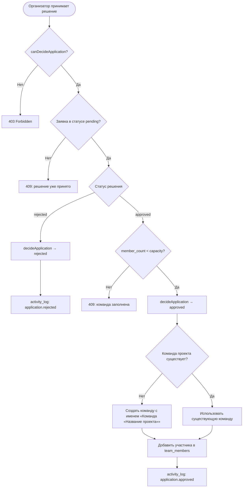

# Алгоритмы: приём заявок и формирование команд

## 1. Проверка применимости заявки (`checkApplicationEligibility`)

Реализация: `src/lib/domain/eligibility.ts`. Функция чистая — принимает срез данных о
проекте, заявителе и текущем состоянии команды, возвращает список причин отказа (может
быть пустым, если заявка допустима). Используется в `POST /api/applications` перед записью
в базу и на клиенте (`src/app/(app)/projects/[id]/page.tsx`) для показа объяснения вместо
формы, если подать заявку нельзя.

```mermaid
flowchart TD
  Start([Заявка на проект]) --> C1{Проект в статусе recruiting?}
  C1 -- Нет --> R1[Причина: project_not_recruiting]
  C1 -- Да --> C2{Есть активная заявка participant на этот проект?}
  C2 -- Да --> R2[Причина: duplicate_active_application]
  C2 -- Нет --> C3{age_group проекта = any ИЛИ совпадает с участником?}
  C3 -- Нет --> R3[Причина: age_group_mismatch]
  C3 -- Да --> C4{Одобренных участников меньше вместимости?}
  C4 -- Нет --> R4[Причина: team_full]
  C4 -- Да --> OK([Заявка допустима])
  R1 --> Collect[Собрать все применимые причины]
  R2 --> Collect
  R3 --> Collect
  R4 --> Collect
  Collect --> Result([eligible = false, reasons = [...]])
```

Важное свойство алгоритма: причины **накапливаются**, а не возвращаются по первой
найденной — это даёт участнику полную картину, почему заявка невозможна, одним запросом.
Покрыто тестом `authorization.test.ts`/`eligibility.test.ts`
(«accumulates multiple failure reasons at once»).

## 2. Решение по заявке и формирование команды

Реализация: `PATCH /api/applications/[id]/route.ts`. Алгоритм выполняется атомарно в
рамках одного HTTP-запроса:



Формирование команды не является отдельным шагом, инициируемым организатором — оно
происходит **автоматически при первом одобрении заявки на проект** (`getOrCreateTeam`),
что реализует требование ФТ-10. Каждый следующий одобренный участник добавляется в ту же
команду, пока не будет достигнута вместимость проекта, гарантированная проверкой `Cap`.

## 3. Соответствие компетенций (`computeFitScore`)

Реализация: `src/lib/domain/fit.ts`. Алгоритм не блокирует подачу заявки (это
информационная метрика для организатора/участника), но формализует, насколько профиль
участника соответствует требованиям проекта:

1. Если у проекта нет требований к компетенциям — соответствие максимально (`score = 1`).
2. Для каждого требования `{competencyId, minLevel}` ищется уровень участника по этой
   компетенции (`0`, если компетенция не указана в профиле).
3. Требование считается выполненным, если `level >= minLevel`.
4. Итоговая оценка — доля выполненных требований от общего числа; невыполненные
   компетенции возвращаются отдельным списком `missing` для точечной обратной связи.

Эта функция подготовлена как основа для будущего ранжирования заявок в очереди
организатора (сортировка по соответствию) — в текущей версии интерфейс показывает список
требуемых компетенций на карточке проекта, а расчёт покрыт модульными тестами.
