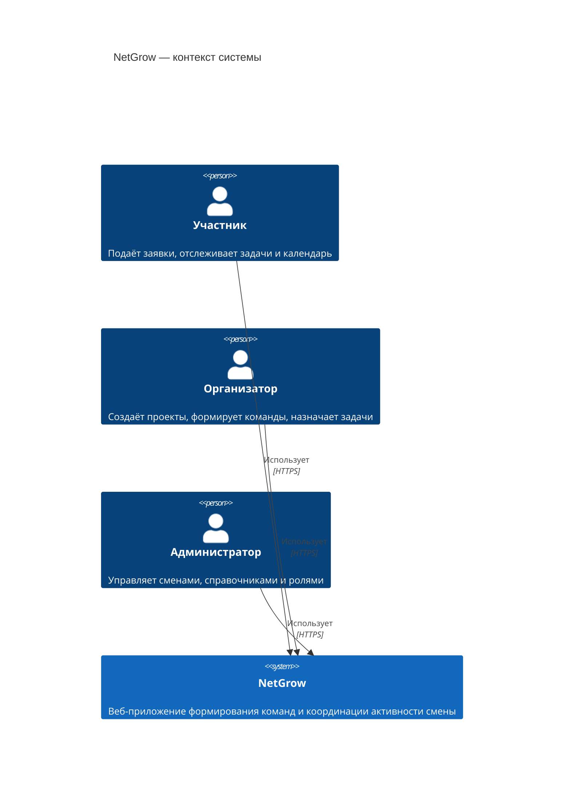
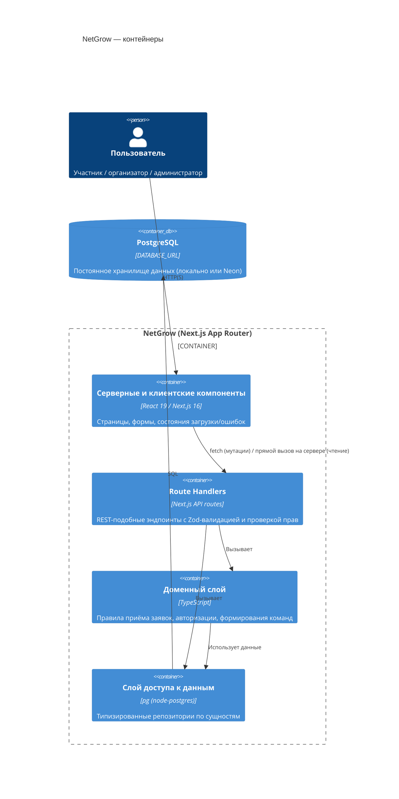
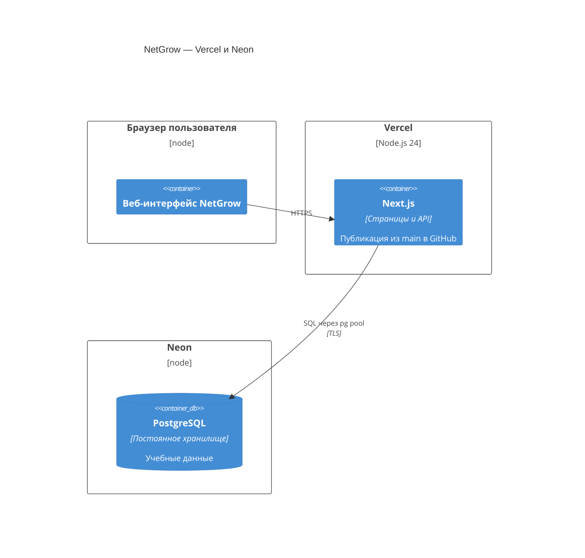

# Архитектура системы NetGrow

## 1. Назначение и контекст

NetGrow — информационная система для формирования проектных команд и координации
образовательной деятельности в детском оздоровительном лагере (условное ООО «Детский
оздоровительный лагерь "Дружба"»). Система решает задачу автоматизации трёх связанных
процессов: публикация проектов, подача и рассмотрение заявок участников, формирование
команд и распределение задач.

Система реализована как самостоятельное учебное приложение для выпускной квалификационной
работы. Все данные, роли и метрики синтетические и не связаны с какими-либо реальными
коммерческими продуктами.

### 1.1. Контекстная диаграмма (C4, уровень Context)

Интерфейс не загружает внешние шрифты и стили. Онлайн-редакция требует сетевого
подключения к PostgreSQL; для автономной защиты сохранена SQLite-редакция
в отдельной ветке `academic-sqlite` (НФТ-04 в `requirements.md`).

## 2. Компонентная архитектура

### 2.1. Слои приложения

| Слой | Расположение | Ответственность |
| --- | --- | --- |
| Представление | `src/app/**/page.tsx`, `src/components/**` | Рендеринг экранов, состояния загрузки/пустоты/ошибки, формы |
| API (граница системы) | `src/app/api/**/route.ts` | Аутентификация сессии, авторизация, Zod-валидация, вызов домена и репозиториев, единый формат ошибок |
| Домен | `src/lib/domain/**` | Чистые функции бизнес-правил: приёмлемость заявки, авторизация действий, соответствие компетенций |
| Доступ к данным | `src/lib/db/**` | Схема PostgreSQL, типы строк, репозитории по сущностям, сид/сброс данных |

Серверные компоненты (страницы) для операций чтения обращаются к репозиториям напрямую —
это стандартный паттерн Next.js App Router и не нарушает границу авторизации, так как
мутации всегда проходят через `route.ts`-обработчики, где и выполняется проверка прав.

## 3. Развёртывание онлайн-редакции

Локальный запуск онлайн-редакции требует Node.js и отдельно запущенный PostgreSQL.
В облаке код и база развёртываются независимо: повторная публикация приложения
не сбрасывает данные. Порядок первоначального заполнения и ограничения демо-режима
описаны в `deployment.md`. `db:reset` применяется только как явная разрушительная операция.

Production-рекомендации (не реализованы в демо-версии осознанно) вынесены в `security.md`.

## 4. Границы безопасности

- **Демо-аутентификация**: вход выполняется через выбор одного из синтетических аккаунтов
  (`POST /api/session`), без пароля — это специально отмечено в интерфейсе как демо-режим.
- **Авторизация**: каждая мутация в `src/app/api/**/route.ts` проверяет роль и, где нужно,
  владение сущностью через чистые функции `src/lib/domain/authorization.ts`, независимо от
  того, что показывает клиентский интерфейс.
- **Валидация**: все входящие тела запросов проверяются схемами Zod (`src/lib/validation/schemas.ts`)
  до обращения к базе данных.
- **Сессия**: `HttpOnly`, `SameSite=Lax` cookie; флаг `Secure` включается автоматически в
  production-сборке (`NODE_ENV=production`). Подробности и рекомендации — в `security.md`.

## 5. Технологический стек

| Категория | Технология | Причина выбора |
| --- | --- | --- |
| Фреймворк | Next.js 16 (App Router), React 19 | Единая кодовая база для SSR-страниц и API, встроенная маршрутизация |
| Язык | TypeScript (strict) | Статическая проверка типов на границах домена и API |
| Стили | Tailwind CSS 4 | Быстрая сборка сдержанного интерфейса без отдельной дизайн-системы |
| Иконки | lucide-react | Лёгкий набор SVG-иконок без внешних запросов |
| База данных | PostgreSQL (pg / node-postgres) | Постоянное хранилище, пригодное для развёртывания (Neon) |
| Валидация | Zod | Декларативная проверка данных на границе API |
| Тесты | Vitest + Testing Library, Playwright | Модульные/компонентные тесты и сквозной сценарий защиты |
| Пакетный менеджер | pnpm | Быстрая и детерминированная установка зависимостей |

Зависимости не добавлялись «про запас»: каждая библиотека закрывает конкретный пункт
технического задания (см. `PROJECT_BRIEF.md`).
