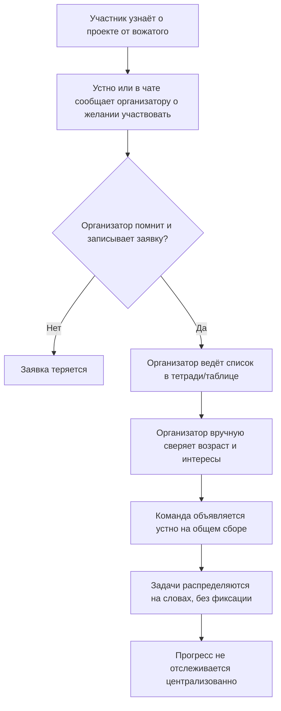
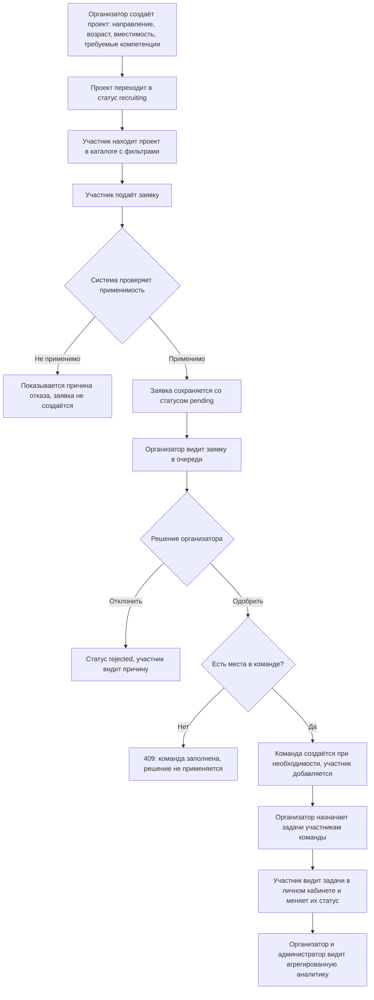

# Бизнес-процессы NetGrow

## 1. AS-IS: формирование команд без информационной системы

До внедрения системы организаторы смены собирают заявки участников устно или через общий
чат, ведут учёт в бумажных списках или разрозненных таблицах. Это создаёт типовые проблемы:
потерю заявок, дублирующиеся записи, отсутствие единого списка компетенций участников и
задержки в формировании команд.



Ключевые проблемы AS-IS: отсутствие единой точки правды по заявкам, ручная и подверженная
ошибкам проверка возрастных/компетентностных ограничений, отсутствие истории решений и
невозможность быстро посчитать показатели (заполненность команд, скорость рассмотрения
заявок) для отчётности лагеря.

## 2. TO-BE: процесс с использованием NetGrow



### 2.1. Ключевые улучшения относительно AS-IS

| AS-IS | TO-BE |
| --- | --- |
| Заявки фиксируются устно/в чате | Заявки хранятся в базе данных со статусом и историей решений |
| Проверка возраста/компетенций вручную | Автоматическая проверка приемлемости (`checkApplicationEligibility`) |
| Команда объявляется на словах | Команда формируется автоматически при одобрении первой заявки |
| Задачи не фиксируются | Задачи хранятся с исполнителем, сроком и статусом |
| Нет сводных показателей | Раздел аналитики: статусы проектов/заявок/задач, заполненность, среднее время решения |
| Нет журнала действий | `activity_log` фиксирует ключевые мутации для последующего разбора |

## 3. Процесс рассмотрения заявки (детально)

```mermaid
sequenceDiagram
  actor Participant as Участник
  actor Organizer as Организатор
  participant API as API (route handlers)
  participant DB as SQLite

  Participant->>API: POST /api/applications {projectId, message}
  API->>DB: получить проект, активные заявки, участников
  API->>API: checkApplicationEligibility()
  alt заявка неприменима
    API-->>Participant: 409 + причины отказа
  else заявка применима
    API->>DB: создать заявку (status=pending)
    API-->>Participant: 201 Created
  end

  Organizer->>API: PATCH /api/applications/:id {status: approved}
  API->>API: canDecideApplication(actor, project.organizerId)
  API->>DB: проверить вместимость команды
  alt мест нет
    API-->>Organizer: 409 Conflict
  else есть место
    API->>DB: обновить статус заявки
    API->>DB: getOrCreateTeam + addTeamMember
    API->>DB: activity_log: application.approved
    API-->>Organizer: 200 OK
  end
```
