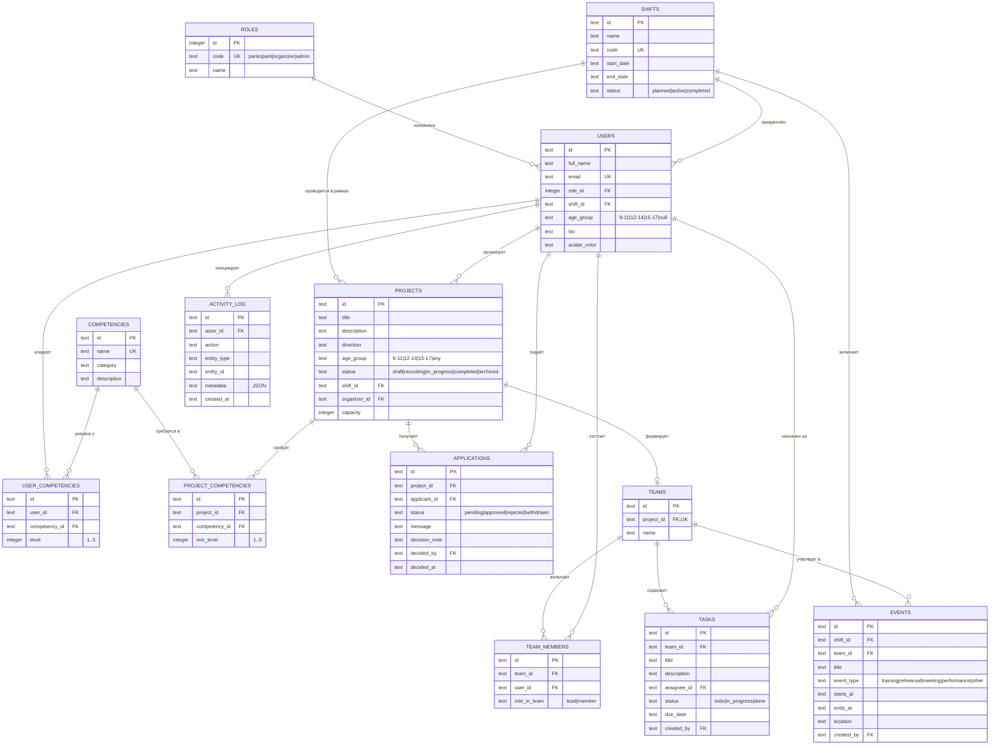

# Модель данных NetGrow

Схема реализована в `src/lib/db/schema.sql` (SQLite). Диаграмма ниже отражает
фактически созданные таблицы, ключи и ограничения.

## 1. ER-диаграмма

## 2. Описание сущностей

| Сущность | Назначение | Ключевые ограничения |
| --- | --- | --- |
| `roles` | Справочник ролей | `code` уникален, ограничен `CHECK` тремя значениями |
| `shifts` | Смены лагеря | `code` уникален |
| `users` | Пользователи (все роли) | `email` уникален, `role_id` обязателен, `age_group` ограничен `CHECK` |
| `competencies` | Справочник компетенций | `name` уникален |
| `user_competencies` | Компетенции участника с уровнем 1–5 | `UNIQUE(user_id, competency_id)` |
| `projects` | Проекты | `capacity > 0`, `status`/`age_group` ограничены `CHECK` |
| `project_competencies` | Требуемые компетенции проекта | `UNIQUE(project_id, competency_id)` |
| `applications` | Заявки на участие | Частичный уникальный индекс `uq_applications_active` — не более одной активной (`pending`/`approved`) заявки на пару (проект, участник) |
| `teams` | Команда проекта | `project_id` уникален — у проекта не более одной команды |
| `team_members` | Состав команды | `UNIQUE(team_id, user_id)` |
| `tasks` | Задачи команды | `status` ограничен `CHECK`, `assignee_id` может быть пустым |
| `events` | Мероприятия смены | Может быть привязано к команде (`team_id`) или быть общим для смены |
| `activity_log` | Журнал действий | Хранит только идентификаторы и служебные метаданные, без персональных секретов |

## 3. Индексы

Индексы созданы на всех внешних ключах и часто фильтруемых полях (`projects.status`,
`projects.direction`, `applications.status`, `tasks.status`, `activity_log.entity_type,
entity_id`, `events.starts_at`) — см. полный список в `src/lib/db/schema.sql`.

## 4. Целостность на уровне приложения

Помимо ограничений БД, доменный слой (`src/lib/domain/eligibility.ts`) дополнительно
проверяет вместимость команды и возрастное соответствие перед созданием заявки — это
защищает от гонок между проверкой на клиенте и фактическим состоянием базы данных, так как
финальная проверка всегда выполняется на сервере непосредственно перед записью.
